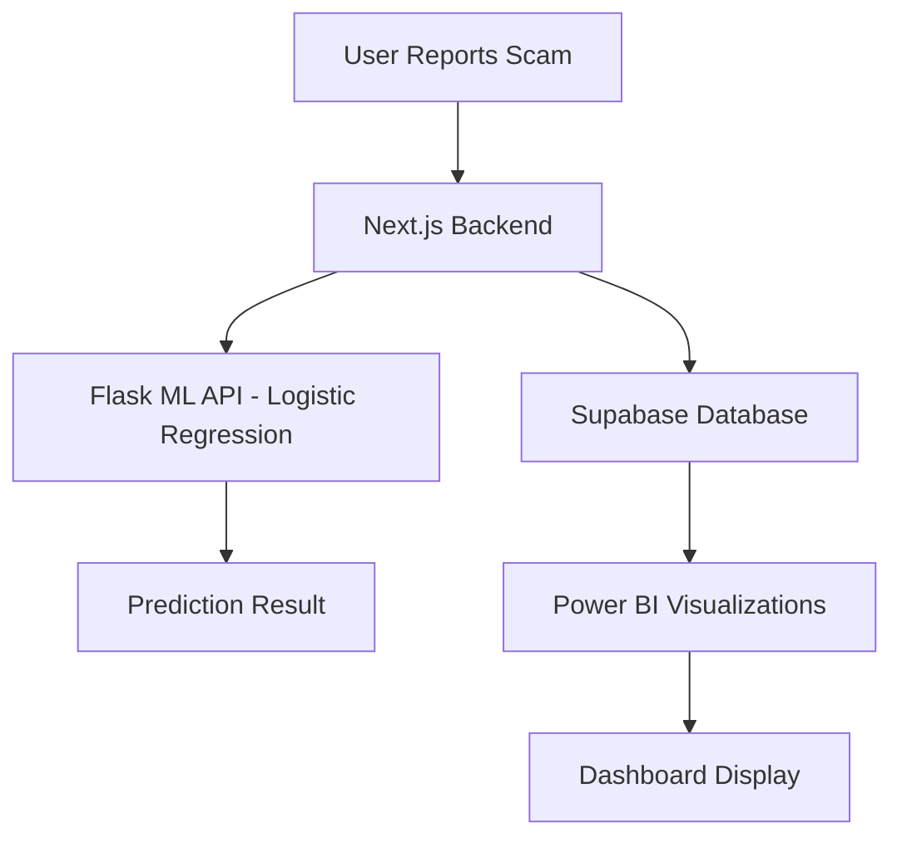

# 🇲🇾 Malaysia Scam and Fraud Dashboard

An interactive web-based platform designed to **monitor, analyze, and predict scam activities in Malaysia**, integrating descriptive and predictive analytics to combat digital fraud effectively.


---

## 📌 Overview

The **Malaysia Scam and Fraud Dashboard** centralizes scam reports, social media mentions, and official data sources like **MyCERT reports**, enabling users, analysts, and organizations to:

* Submit and review scam reports
* Detect scam trends and hotspots
* Predict scam likelihood using a **Logistic Regression model**
* Visualize scam analytics with **Power BI**

---

## 🚀 Features

✅ **User Features**

* Scam report submission
* Fraud classification (scam/non-scam)
* Downloadable report summaries

✅ **Admin Features**

* Manage scam types
* Approve/reject submitted reports
* Monitor dashboard statistics
* Export data to CSV

✅ **Machine Learning Integration**

* Logistic Regression model for scam classification
* 85% prediction accuracy

✅ **Visual Analytics**

* Real-time Power BI dashboards
* Geographic scam hotspots
* Trends over time

---

## 🛠️ Tech Stack

* **Frontend**: React + Tailwind CSS
* **Backend**: Next.js API Routes + Flask ML API
* **Database**: Supabase (PostgreSQL)
* **Machine Learning**: Python (scikit-learn, Logistic Regression)
* **Visualization**: Power BI

---

## 📸 Screenshots

| Dashboard                               | Report Submission                                 | Scam Prediction                                  |
| --------------------------------------- | ------------------------------------------------- | ------------------------------------------------ |
|  |  |  |

---

## 🔄 System Architecture



---

## 📥 Installation

1️⃣ **Clone Repository**

```bash
git clone https://github.com/AhmedTrying/malaysiasafd.git
cd malaysiasafd
```

2️⃣ **Install Frontend Dependencies**

```bash
npm install
npm run dev
```

3️⃣ **Setup Backend ML API**

```bash
cd python/
pip install -r requirements.txt
python predict_scam.py
```

4️⃣ **Connect Supabase**

* Add your Supabase keys in `.env.local`

5️⃣ **Access Dashboard**

```bash
http://localhost:3000
```

---

## 📊 Dataset

The ML model was trained on **300+ scam & non-scam cases** from MyCERT reports, covering:

* Investment scams
* Employment scams
* Phishing attacks
* Romance scams
* Loan scams

---

## ✅ Evaluation

* **Prediction Accuracy**: 85%
* **Processing Time**: < 3 seconds
* **User Feedback**: 4.7/5

---

## 📖 References

* CyberSecurity Malaysia (2023)
* Bank Negara Malaysia (2023)
* MyCERT Reports

---

## 🙌 Acknowledgments

This project was developed as part of **UTM Final Year Project (PSM2)** under the guidance of **PM Dr. Anazida Zainal**.

Special thanks to **Magnifi Machines** for stakeholder collaboration in fraud analytics.

---

## 📜 License

MIT License © 2025

